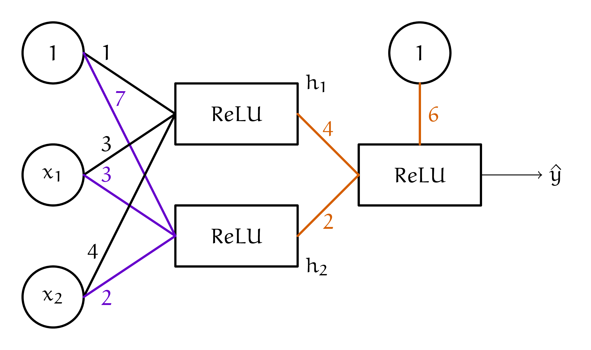

# 3. Из формулы в картинку

Маша написала на бумажке функцию: 

$$
y = \max(0, 4 \cdot \max(0, 3 \cdot x_1 + 4 \cdot x_2 + 1) + 2 \cdot \max(0, 3 \cdot x_1 + 2 \cdot x_2 + 7) + 6)
$$

Теперь она хочет, чтобы кто-нибудь из её адептов нарисовал её в виде нейросетки. Нарисуйте.

```{dropdown} Решение
Начнём рисовать картинку с конца. На выход выплёвывается либо $0$, либо комбинация из двух входов: 

$$
\hat y = ReLU(4 \cdot h_1 + 2 \cdot h_2 + 6)
$$

Каждый из входов --- это снова либо $0$, либо комбинация из двух входов. 

$$
y = \max(0, {\color{red} 4} \cdot \underbrace{\max(0, 3 \cdot x_1 +  4 \cdot x_2 + 1)}_{h_1} + {\color{red} 2} \cdot \underbrace{\max(0, {\color{purple} 3} \cdot x_1 + {\color{purple} 2} \cdot x_2 + {\color{purple} 7})}_{h_2} + {\color{red} 6})
$$

Получается, что на первом слое находится два нейрона, которые передают свои выходы в третий:




```
