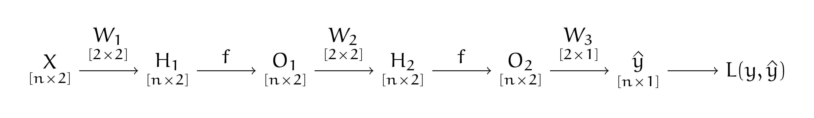
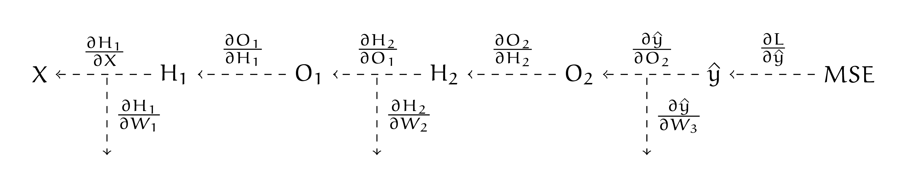

# 5. Бэкпроп в матричном виде

У Маши есть нейросеть с картинки ниже, где $w_{ij}^k$ --- веса для $k-$го слоя, $f(t)$ --- какая-то функция активации. Маша хочет научиться делать для такой нейронной сетки градиентный спуск.


```{figure} ../images/problem_set_03/img05_task.png
---
width: 95%
name: one_dim_nn
---
```

:::{seealso}
Мы будем записывать все производные в матричном виде. Иногда будут всплывать слова «матричные производные». При разборе этой задачи можно про них ничего не знать, в решении они не используются. Мы нашли в предыдущих упражнениях все производные, нужные для вывода алгоритма обратного распространения ошибки. Тем не менее, техника матричного дифференцирования очень полезна. Поэтому я рекомендую вам её изучить. Ей посвящена последняя глава книги.
:::

__а)__  Запишите Машину нейросеть, как сложную функцию. Сначала в виде нескольких уравнений, а затем в матричном виде. 


```{dropdown} Решение
Договоримся до следующих обозначений. Буквами $h^k_{ij}$ будем обозначать выход $k-$го слоя для $j-$го нейрона для $i-$го наблюдения до применения функции активации. Буквами  $o^k_{ij}$ будем обозначать всё то же самое после применения функции активации. Например, для первого слоя:

\begin{equation*}
    \begin{aligned} 
    & h^1_{i1} = w^1_{11} \cdot x_{i1} +  w^1_{21} \cdot x_{i2} \\
    & o^1_{i1} = f(h_{i1}^1). \\
    \end{aligned} 
\end{equation*}

**Делай раз.** Для начала перепишем сетку в виде нескольких уравнений. Для первого слоя мы находим

\begin{equation*}
    \begin{aligned} 
    & o^1_{i1} = f( w^1_{11} \cdot x_{i1} +  w^1_{21} \cdot x_{i2}) \\
    & o^1_{i2} = f( w^1_{12} \cdot x_{i1} +  w^1_{22} \cdot x_{i2}). \\
    \end{aligned} 
\end{equation*}

Для второго работают аналогичные уравнения, но значения $x$ заменяются на соответствующие $o$. На выходе мы предсказываем $y$, как взвешенную суммы выходов со второго слоя

$$
\hat{y}_i = w_1^3 \cdot o^2_{i1} + w_2^3 \cdot o^2_{i2}.
$$

Подставим вместо $o^2_{1i}$ и $o^2_{2i}$ результат вычисления предыдущих слоёв

$$
\hat{y}_i = w_1^3 \cdot f( w^1_{12} \cdot o^1_{i1} +  w^1_{22} \cdot o^1_{i2}) + w_2^3 \cdot f( w^1_{12} \cdot o^1_{i1} +  w^1_{22} \cdot o^1_{i2}).
$$

Подставим результат вычисления первого слоя 

\begin{multline*}
\hat{y}_i = w_1^3 \cdot f( w^1_{12} \cdot f( w^1_{11} \cdot x_{i1} +  w^1_{21} \cdot x_{i2}) +  w^1_{22} \cdot f( w^1_{12} \cdot x_{i1} +  w^1_{22} \cdot x_{i2})) + \\ + w_2^3 \cdot f( w^1_{12} \cdot f( w^1_{11} \cdot x_{i1} +  w^1_{21} \cdot x_{i2}) +  w^1_{22} \cdot f( w^1_{12} \cdot x_{i1} +  w^1_{22} \cdot x_{i2})).
\end{multline*}

Мы записали нашу нейросеть в виде сложной функции. Выглядит ужасно. 

Давайте перепишем всё то же самое более компактно, в матричном виде. Начнём с первого слоя. На самом деле, чтобы найти строчку $(h^1_{i1}, h^1_{i2})$ мы делаем матричное умножение. Строчку $(x_{i1},  x_{i2})$ мы умножаем на матрицу весов $W_1$

\begin{equation*} 
    \begin{pmatrix} h^1_{i1} & h^1_{i2} \end{pmatrix} =  \begin{pmatrix} x_{i1} &  x_{i2}\end{pmatrix} \cdot \begin{pmatrix} w^1_{11} &  w^1_{12} \\ w^1_{21} & w^1_{22}\end{pmatrix}.
\end{equation*} 

Чтобы получить $h_1$ мы умножаем строчку из переменных на первый столбец, чтобы получить $h_2$, на второй столбец. Получается, что в терминах матриц каждый нейрон нашей сети --- это столбец. Если мы добавим ещё один столбец из весов в матрицу, это будет эквивалентно добавлению в сетку третьего нейрона, так как на выходе мы будем получать ещё и $h_3$. Если у нас появится дополнительный вход $x_3$, в матрицу нам нужно будет добавить ещё одну строчку из весов. 

Запишем первый слой в матричном виде. На вход идёт матрица из наблюдений $X_{[n \times 2]}$, она умножается на матрицу весов $W_{[2 \times 2]}$, получается матрица $H_{[n \times 2]}$. Ко всем элементам этой матрицы мы применяем функцию активации $f$. Делаем это поэлементно

$$
O_1 = f(H_1) = f(X\cdot W_1).
$$

Остальные слои записываются по аналогии. Получается, что наша нейросеть в матричном виде выглядит как 

$$
\hat{y} = f(f(X\cdot W_1) \cdot W_2) \cdot W_3.
$$

Здесь $\hat{y}$ --- вектор столбец размера $[n \times 1]$, а матрицы весов обладают размерностями $[2 \times 2]$, $[2 \times 2]$ и $[2 \times 1]$ соответственно. 
```

__б)__  Выпишите все производные в том виде, в котором их было бы удобно использовать для алгоритма обратного распространения ошибки, а затем, сформулируйте сам алгоритм. Нарисуйте под него удобную схемку.

```{dropdown} Решение
**Делай два.** Выпишем алгоритм обратного распространения ошибки в виде красивой схемки. Сначала мы делаем прямой проход по нейросети (forward pass): 



Под всеми матрицами подписаны размерности. Взятие функции активации --- поэлементная операция, она никак не меняет размер матрицы. Это будет важно при взятии производных. В ходе прямого прохода мы запоминаем все промежуточные результаты. Они нам пригодятся для поиска производных при обратном проходе. Например, $\frac{\partial H_2}{\partial W_2} = O_1^T.$ Получается, в какой-то момент нам надо будет переиспользовать результаты вычислений, полученных при прямом проходе.

Наша нейросеть --- граф вычислений. Давайте запишем для каждого ребра в рамках этого графа производную. 



Осталось только аккуратно записать обратный ход алгоритма. Заведём для накопленного значения производной переменную $d$. На первом шаге нам надо найти $\frac{\partial L}{\partial W_3}$. Не будем забывать, как выглядят производные для линейного слоя, полученные в предыдущей задаче. Сделаем это в два хода

\begin{equation*} 
	\begin{aligned}
		&  d = \frac{\partial L}{\partial \hat y} \\
		&  \frac{\partial L}{\partial W_3} = \frac{\partial L}{\partial \hat y} \cdot \frac{\partial \hat y}{\partial W_3} = O_2^T \cdot d.
	\end{aligned}
\end{equation*}

Матрица $O_2^T$ будет размера $[2 \times n],$ вектор $d$ будет размера $[n \times 1]$, размер производной будет $[2 \times 1],$ что совпадает с размером матрицы $W_3.$

Для поиска производной $\frac{\partial L}{\partial W_2}$ переиспользуем значение, которое накопилось в $d$

\begin{equation*} 
	\begin{aligned}
		&  d = \frac{\partial L}{\partial H_2} = d \cdot \frac{\partial \hat y}{\partial O_2} \cdot \frac{\partial O_2}{\partial H_2} = d \cdot W_3^T * f'(H_2) \\
		&  \frac{\partial L}{\partial W_2} = O_1^T \cdot d.
	\end{aligned}
\end{equation*}

Размер $d$ был $[n \times 1],$ после персчёта стал $[n \times 1] \cdot [1 \times 2] * [n \times 2] =  [n \times 2].$ Поэлементное умножение на производную функции активации не повлияло на размер матрицы. Размер производной $\frac{\partial L}{\partial W_2}$ оказывается  $[2 \times 2],$ что совпадает с размером матрицы $W_2.$

Осталась заключительная производная $\frac{\partial L}{\partial W_1}$. Нам надо найти 

\begin{equation*} 
	\begin{aligned}
		&  d = \frac{\partial L}{\partial H_1} = \frac{\partial L}{\partial H_2} \cdot  \frac{\partial H_2}{\partial O_1} \cdot \frac{\partial O_1}{\partial H_1} = d \cdot W_2^T * f'(H_1)\\
		&  \frac{\partial L}{\partial W_1} = X^T \cdot d.
	\end{aligned}
\end{equation*}

Если бы сетка была глубже, мы продолжили бы переиспользовать $d$. Каждую производную мы посчитали один раз. Такой алгоритм обучения линеен по числу параметров.
```
