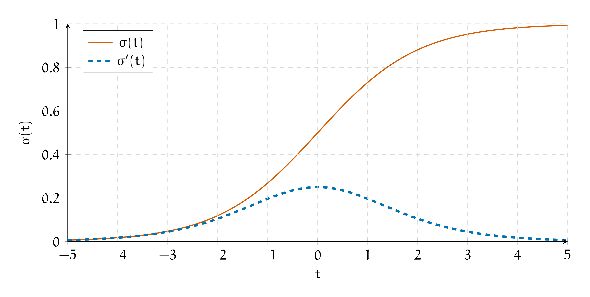
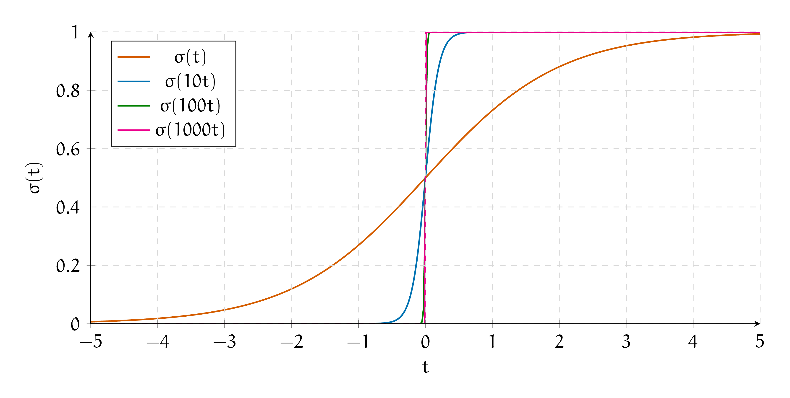
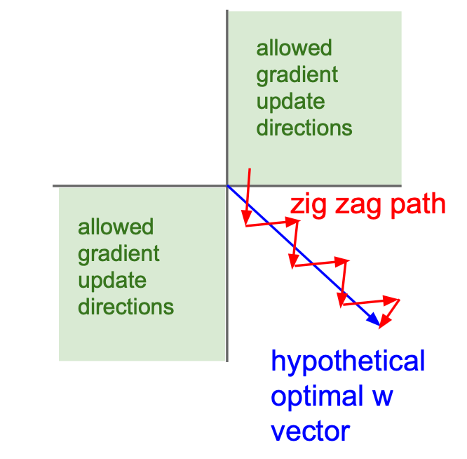

# 1. Сигмоида

Сигмоида -- это классическая функция активации. У неё есть куча проблем, из-за которых её нужно очень аккуратно использовать в глубоких нейронных сетях. Давайте обсудим эти проблемы и поймём, как правильно её использовать.


Любую $s$-образную функцию называют сигмоидой. Наиболее сильно прославилась под таким названием функция 

$$
\sigma(t) = \frac{e^t}{1 + e^t} = \frac{1}{1 + e^{-t}}.
$$ 

Слава о ней добралась до Маши и теперь она хочет немного поисследовать её свойства.[^mynotebb]


__а)__ Что происходит при $t \to +\infty$? А при $t \to -\infty$?

```{dropdown} Решение
Мы знаем, что при $t \to +\infty$ функция $e^{-t} \to 0$, значит $\sigma(t) \to 1.$ 

По аналогии при $t \to -\infty$ функция $e^{-t} \to \infty$, значит $\sigma(t) \to 0.$ 

Сигмоида -- это функция распределения логистической случайной величины. Обычно её используют при решении задачи классификации, чтобы отнормировать выход нейросети на отрезок $[0;1]$.

Если для оптимизации используется logloss, сигмоида интерпретируется как $\mathbb{P}(y = 1 \mid x).$  Это можно формально доказать. [В конспекте по МО-1 с ФКН](https://github.com/esokolov/ml-course-hse/blob/master/2022-fall/seminars/sem06-probs-quantile.pdf) описывается подход для этого. Мы займёмся этим в последней задачке этого листочка. 

```

__б)__ Как связаны между собой $\sigma(t)$ и  $\sigma(-t)$?

```{dropdown} Решение
$$
\sigma(-t) = \frac{1}{1 + e^t} = \frac{1 + e^t - e^t}{1 + e^t} = 1 - \sigma(t).
$$

```

__в)__ Как связаны между собой $\sigma(t)$ и $\sigma'(t)$? 

```{dropdown} Решение
Мы уже решали этот пункт в листочке про обратное распространение ошибки. Воспроизведём логику из него. 

\begin{multline*}
\sigma'(t) = \left(\frac{e^t}{1 + e^{t}} \right)' = \frac{e^t}{1 + e^{t}} - \frac{e^t}{(1 + e^{t})^2} \cdot e^t  = \\ = \frac{e^t}{1 + e^{t}} \left(1 - \frac{e^t}{1 + e^{t}} \right) = \sigma(t)(1 - \sigma(t)).
\end{multline*}


```

__г)__ Найдите $\sigma(0)$ и $\sigma'(0)$.

```{dropdown} Решение
Подставим ноль в получившиеся формулы

\begin{equation*} 
	\begin{aligned}
		& \sigma(0) = \frac{1}{1 + e^{-0}} = 0.5 \\
		& \sigma'(0) = \sigma(0) \cdot (1 - \sigma(0)) = 0.25 \\
	\end{aligned}
\end{equation*}

```

__д)__ Найдите обратную функцию $\sigma^{-1}(t)$

```{dropdown} Решение
\begin{equation*} 
	\begin{aligned}
		& y = \frac{1}{1 + e^{-t}} \\
		& e^{-t} = \frac{1}{y} - 1 = \frac{1 - y}{y}
		& t = \ln \frac{y}{1 - y}
	\end{aligned}
\end{equation*}

Вспомним, что $\sigma(t) = \mathbb{P}(y = 1 \mid x)$, значит 

$$
\sigma^{-1}(t) = \ln \frac{\mathbb{P}(y = 1 \mid x)}{1 - \mathbb{P}(y = 1 \mid x)}. 
$$

Эту величину называют **логит.** Когда с помощью нейронных сетей решают задачу классификации, часто специфицируют модель так, чтобы она прогнозировала на последнем слое логит. Если взять от логита сигмоиду, мы получим $\mathbb{P}(y = 1 \mid x).$ 

Кстати говоря, модель градиентного бустинга для классификации, обычно, собирают так, чтобы она тоже прогнозировала на выходе логит.

```

__е)__ Как связаны между собой $[\ln \sigma(t)]'$ и $\sigma(-t)$?

```{dropdown} Решение
$$
[\ln \sigma(t)]'_t = \frac{1}{\sigma(t)} \cdot \sigma'(t) = \frac{1}{\sigma(t)} \cdot \sigma(t) \cdot (1 - \sigma(t)) = 1 - \sigma(t) = \sigma(-t).
$$

```

__ё)__ Постройте графики функций $\sigma(t)$ и $\sigma'(t)$.

```{dropdown} Решение

Сигмоида выглядит как функция распределения. Она не убывает. У неё две асимптоты, $0$ и $1$. Она выглядит "S"-образно. Её производная выглядит как выпуклый холмик. Если хочется, можно по-честному взять от неё все производные и построить график функции, как это [делалось на математическом анализе.](http://www.mathprofi.ru/polnoe_issledovanie_funkcii_i_postroenie_grafika.html) 



```

__ж)__ Говорят, что сигмоида --- это гладкий аналог единичной ступеньки. Попробуйте построить на компьютере графики $\sigma(t), \sigma(10\cdot t), \sigma(100\cdot t), \sigma(1000\cdot t)$. Как они себя ведут?

```{dropdown} Решение
Видно, что чем больше коэффициент перед $t$, тем резче перепад у графика. При очень большом значении коэффициента, сигмоида очень напоминает ступеньку, но в отличие от неё она дифференцируема. 



```

__з)__ Выпишите формулы для forward pass и backward pass через слой с сигмоидой.

```{dropdown} Решение
Мы уже нашли выше производную. У сигмоиды нет обучаемых параметров, получается прямой проход через неё делается по формуле

$$
o = \sigma(h).
$$

Обратный шаг делается по формуле

$$
d = \sigma(h) \cdot (1 - \sigma(h)) \cdot d.
$$

То же самое можно записать как 

$$
\frac{\partial L}{\partial h} = \sigma(h) \cdot (1 - \sigma(h)) \cdot \frac{\partial L}{\partial o}.
$$

```

__и)__ Какое максимальное значение принимает производная сигмоиды? Объясните как это способствует затуханию градиента и параличу нейронной сети?

```{dropdown} Решение
Проанализируем функцию 

$$
f(\sigma) = \sigma \cdot (1 - \sigma) = \sigma - \sigma^2.
$$

Это парабола. Её ветви смотрят вниз. Найдём её экстремум

$$
f'(\sigma) = 1 - 2\sigma = 0 \quad \Rightarrow \quad \sigma = 0.5
$$

Получается, что $f(\sigma) \le 0.5 - 0.5^2 = 0.25$. Выходит, что производная сигмоиды принимает значение с отрезка $[0; 0.25].$ При шаге обратного распространения ошибки, мы умножаем уже накопившуюся производную на производную сигмоиды. Накопленная производная из-за этого уменьшается. Получается, что если нейросетка очень глубокая, до первых слоёв дойдёт очень маленькая производная. Веса будут двигаться на очень маленькие расстояния. Из-за этого обучение застопорится. Такая ситуация называется **параличём нейронной сети** либо проблемой **затухания градиента (vanishing gradient problem).**

Чтобы побороть проблему затухающих градиентов, надо модернизировать архитектуру нейронной сети так, чтобы не выскакивало затухающих производных. Из-за этого сигмоиду не используют в глубоких нейронных сетях и предпочитают ей другие функции активации. 

Давайте ещё раз посмотрим на график сигмоиды и её производной. 


Каждый нейрон в нашей сетке либо активируется либо нет. Когда нейрон обучился, он выплёвывает значения близкие либо к единице либо к нулю. Производная на краях сигмоиды оказывается очень маленькой. Получается, что по мере обучения нейронной сети, проблема затухающих градиентов обостряется. 

Ужаснее всего то, что на графике с функцией потерь всё выглядит так, будто обучение сошлось. Функция стабилизируется и прекращает убывать.

```

__к)__ Сигмоида не центрированна относительно нуля. Из-за этого градиентный спуск работает плохо. Объясните, почему так происходит. 

```{dropdown} Решение
Мы находим выход слоя как $o = \sigma(h)$. Он всегда положительный. Это означает, что **все** градиенты по весам линейного слоя, идущего перед сигмоидой будут либо положительными либо отрицательными (внимательно посмотрите на формулы из задачи 6 листочка про бэкпроп). Из-за этого веса будут всегда обновляться в одинаковом направлении.

Пусть у нас есть два параметра. По одному надо двигаться в положительную сторону, а по второму в отрицательную (голубая стрелка). Наши градиенты никогда не будут оказываться разных знаков. Они оба всегда будут либо положительными либо отрицательными. Из-за этого движение будет идти зиг-загами. В точку оптимума мы будем идти дольше. 



Чтобы избежать этого, нужно центрировать функцию активации относительно нуля. Тогда градиенты смогут принимать разные знаки и оптимизация будет работать быстрее. 

Картинка взята из курса [cs231n.](http://cs231n.stanford.edu/index.html)

```

[^mynotebb]: Задачка взята из [коллекции Бориса Демешева](https://github.com/bdemeshev/mlearn_pro) и изменена до неузнаваемости. 
