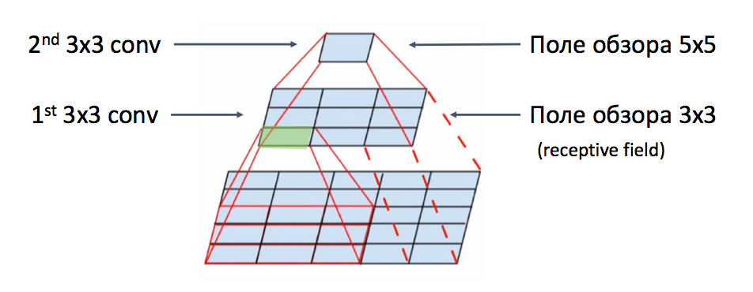
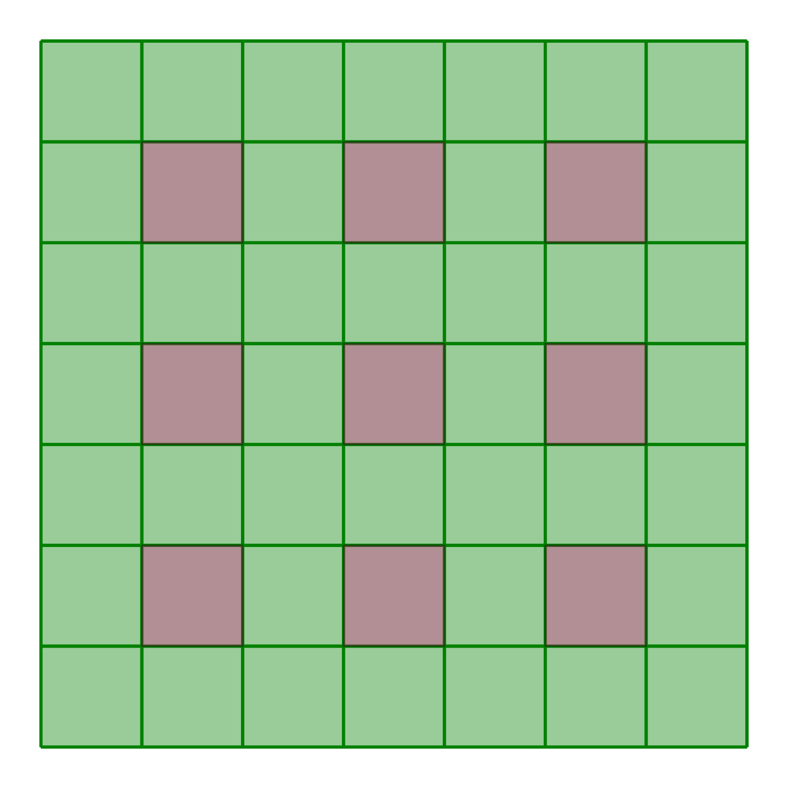
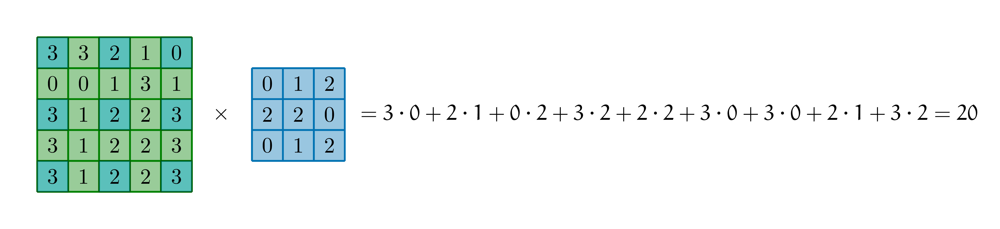

# 7. Поле обзора

У Маши есть картинка очень большого размера. Где-то на ней нарисован котик размера $300 \times 300$ пикселей. Маша хочет найти этого котика с помощью свёрточной сетки. Для этого она использует свёртки размера $3 \times 3$ без дополнения нулями (zero padding). 

 
 __а)__ Через сколько слоёв поле восприятия (receptive field) Машиной нейросетки впервые охватит котика? 


```{dropdown} Решение
Для начала давайте обсудим, что такое [**поле обзора (receptive field).**](https://theaisummer.com/receptive-field/)

Когда человек смотрит на слона издалека, он сразу понимает, что перед ним слон.Если мы будем смотреть на слона слишком близко, мы можем увидеть только его хобот, решить, что перед нами змея и сильно ошибиться. Чтобы делать правильные выводы надо отойти от слона подальше и увидеть его целиком. 

Для свёрточных нейронных сетей действует точно такая же логика. Ей надо увидеть объект целиком, тогда она сделает более точные выводы. 



На картинке выше мы применили к картинке $5 \times 5$ две свёртки размера $3 \times 3$ и информация о том, что на ней находится свернулась в один пиксель. Цифра, записанная в этом пикселе говорит нам о том, что эти две свёртки извлекли из картинки. Поле обзора двух последовательно применённых свёрток равно $5 \times 5$. 

Давайте посмотрим, сколько нам понадобится свёрток, чтобы свернуть котейку в один пиксель. При свёртке $3 \times 3$ на каждом шаге поле обзора увеличивается на две клетки. 

Сначала оно $3 \times 3$, затем $5 \times 5$, затем $7 \times 7$ и так далее. Через $n$ свёрток поле озора окажется $(2n + 1) \times (2n + 1)$. На каждом шаге свёртка убивает одну клетку сверху картинки и одну снизу картинки. Отсюда получается множатель $2$ перед $n$.

Получается, чтобы получить поле обзора больше, чем $300 \times 300$ нам понадобится $150$ слоёв. Это очень много. Хотелось бы растить поле обзора быстрее. Для этого нужны такие инструменты, как пулинг, расширенные свёртки и свёртки со сдвигами.


Можно подойти к решению этой задачки более сложно и выписать рекуррентное уравнение. Пусть $m_n$ -- это поле обзора после приенения $n-$ой свёртки. Другими словами говоря, $m_n$ -- это исходный размер картинки. После применения первой свёртки он изменится. На каждом шаге у нас размерность картинки меняется по формуле 

$$
m_{n - 1} = m_n - 2.
$$

Тут $m_{n-1}$ -- это поле обзора после применения $(n-1)$-ой свёртки. Иначе говоря, это размер картинки после применения первой свёртки. 

При $n-$ом применении свёртки у нас размерность сокращается на два пикселя, а поле обзора растёт на два пикселя. Получается, что 

$$
m_n = m_{n-1} + 2 = m_{n-2} + 2 + 2 = \ldots m_0 + 2 \cdot n.
$$

В самом конце мы получаем один пиксель, поэтому $m_0 = 1$. Получается, что после применения $n$ свёрток, поле обзора по одной из размерностей вырастет до  $2n + 1.$ 

```

__б)__  Сколько нам бы понадобилось слоёв, если бы свёртка Маши была размера $k \times k$, где $k$ -- нечётное число? 


```{dropdown} Решение
Если у нас свёртка $3 \times 3$, то для трёх применённых по очереди свёрток мы получим следующее изменение поля обзора:

$$
3 \times 3 \to 5 \times 5 \to 7 \times 7.
$$

Если свёртка будет размера $5 \times 5$:

$$
5 \times 5 \to 9 \times 9 \to 13 \times 13.
$$

Если мы применим свёртку размера $5 \times 5$ к картинке раземера $13 \times 13$, она уменьшится до картинки $9 \times 9$. Затем получится картинка размера $5 \times 5$, а затем останется один пиксель. Получается в случае свёртки $5 \times 5$ поле обзора изменяется по формуле 

$$
(4n + 1) \times (4n + 1).
$$

Множатель $4$ перед $n$ стоит, так как на каждом шаге картинка по вертикали и горизонтали сокращается на $4$ клетки. 

Получается, в случае свёртки размера $k \times k$ картинка будет с каждой стороны сокращаться на $k - 1$ клетку. Формула для расчёта поля обзора окажется 

$$
\left( (k - 1)\cdot n + 1 \right) \times (k - 1) \cdot n + 1 \right).
$$

По аналогии, такую формулу можно получить через решение рекуррентного уравнения. 

```

__в)__ Сколько нам понадобится слоёв, если Маша использует свёртки размера $3 \times 3$ с дополнением нулями (zero padding) и после каждого свёрточного слоя делает max-pooling размера $2 \times 2$? 

```{dropdown} Решение
Нам надо дойти до размера котика. После первой свёртки размер картинки падает на $2$ пикселя по каждой размерности. После применения пулинга размер картинки сокращается в два раза. 

Какого размера должна быть картинка, чтобы после применения свёртки и пулинга, она превратилась в один пиксель? Составим уравнение и решим его 

$$
\frac{m - 2}{2} = 1 \Rightarrow m = 4.
$$

Какого размера должна быть картинка, чтобы после применения свёртки и пулинга её размерность упала до $4 \times 4$? 

$$
\frac{m - 2}{2} = 4 \Rightarrow m = 10.
$$

Какого размера должна быть картинка, чтобы после применения свёртки и пулинга еэ размерность упала до $10 \times 10$? 

$$
\frac{m - 2}{2} = 10 \Rightarrow m = 22.
$$

Составим уравнение

$$
m_{n - 1} = \frac{m_n - 2}{2}.
$$

Решим его

\begin{multline*}
m_n = 2 \cdot m_{n-1} + 2 = 2 \cdot (2m_{n-2} + 2) + 2 = \\ = 2^2 \cdot m_{n-2} + 2^2 + 2 = \\ =  2^2 \cdot (2 m_{n-3} + 2) + 2^2 + 2 = \\ = 2^3 \cdot m_{n-3} + 2^3 + 2^2 + 2 = \ldots = \\ =  2^n + 2^n + 2^{n-1} + \ldots + 2^3 + 2^2 + 2 = 2^n + 2 \cdot (2^n - 1).
\end{multline*}

Когда мы сворачивали сумму мы воспользовались тем, что $m_0 = 1$ и формулой геометрической прогрессии

$$
S_n = \frac{b_1 \cdot (1 - q^n)}{1 - q}.
$$

Если вместо $n$ по очереди подставить $1,2,3$, можно получить те же результаты, что и выше.

Чтобы охватить котейку размера $300 \times 300,$ нам понадобится $7$ слоёв. Это намного меньше, чем в случае нейросетки без пулинга. 

На практике нам важно добавить в нейросеть столько свёрток и пулингов, чтобы поле обзора докатилось до размерности интересующих нас объектов. [Исследования показывают,](https://theaisummer.com/receptive-field/) что это улучшает качество работы нейросетей. Понятное дело, что на практике такие формулы никто не выводит. Но мы тут занимаемся весёлыми задачками, поэтому можем себе это позволить. 

```

__г)__ Маша хочет поменять max-pooling на свёртки со сдвигом (stride) так, чтобы котейка находился за такое же число слоёв. Какой размер сдвига ей надо выбрать? 


```{dropdown} Решение
Пусть у нашей свёртки параметр сдвига равен $2$, то есть мы прикладываем её к каждой второй клетке. Дополнения у нас нет. если у нас есть картинка размера $7 \times 7$, тогда у нас будет девять точек, куда мы можем приложить якорь свёртки.



На выходе получится картинка размера $3 \times 3$. За одну свёртку она превратиться в один пиксель. Получается, что картинка $7 \times 7$ превращается в картинку $3 \times 3$. По аналогии картинка $15 \times 15$ будет превращаться в картинку $7 \times 7$. 

Получается, что размер картинки падает по формуле 

$$
m_{n-1} = \frac{m_n - 1}{2}.
$$

По аналогии с предыдущим пунктом мы можем развернуть эту формулу относительно поля обзора $m_n$ и получить формулу.

$$
m_n = 2^{n + 1} - 1.
$$

Для того, чтобы найти котейку, достаточно $8$ слоёв. 

```


 __д)__ Пусть $s$ --- величина сдвига, $k$ --- размер свёртки, $d$ --- размер пулинга, $n$ --- номер слоя. Выпишите уравнение, отталкиваясь от которого, можно найти размер поля видимости (receptive field). 

```{dropdown} Решение
Вроде бы надо аккуратно решить уравнение 

$$
m_{n-1} = \frac{m_n - (s - 1) - \dfrac{k-1}{2}}{d},
$$

то получится поле обзора. Читатель, при желании может сделать это и запушить решение сюда. 

```


 __е)__ Маша делает расширенную свёртку (dilated convolution) с параметром расширения равным $r$. Пусть $k$ --- размер свёртки, $n$ --- номер слоя. Выпишите формулу, по которой можно найти размер поля видимости (receptive field).

```{dropdown} Решение
Если $r = 2$, мы будем прикладывать свёртку к каждой второй клетке. Например, для картинки размера $5\times5$ свёртка сработала бы следующим образом 



Получается, при $r=2$ поле обзора одной свёртки будет $5 \times 5.$ Мы предполагаем здесь, что соседние пиксели очень похожи и говорят нам об одном и том же. Картинка размера $9 \times 9$ превратиться в картинку размера $5 \times 5$. Картинка размера $13 \times 13$ в $9 \times 9$. 

Получается, что поле обзора меняется также как у свёртки размера $5 \times 5,$ но часть клеток мы игнорируем при расчёте итогового значения. Найдём число клеток, которое мы будем либо сворачивать либо игнорировать такой свёрткой при одной операции. Свёртка прикладывается к $k$ числам, между этими числами у нас есть зазор, который состоит из $(k - 1) \cdot (r-1)$ числа. Получается, что мы охватываем $k + (k - 1) \cdot (r - 1)$ число. Подставим это выражение в формулу обычной свёртки вместо $k$ и получим требуемую формулу


$$
[k + (k - 1) \cdot (r - 1) - 1)\cdot n + 1] \times [k + (k - 1) \cdot (r - 1) - 1) \cdot n + 1].
$$

```


__ж)__ Пусть Маша делает после каждого свёрточного слоя нормализацию по батчам. Как это повлияет на поле обзора? А если Маша делает между слоями остаточные связи (skip-conection)? 


```{dropdown} Решение
Ответ на эти вопросы неочевиден. Найти его вы можете, прочитав обзорный туториал про поле обзора, на который я ссылаюсь уже третий раз.[^mynoterf]

```

[^mynoterf]: [Understanding the receptive field of deep convolutional networks](https://theaisummer.com/receptive-field/#understanding-the-effective-receptive-field)


